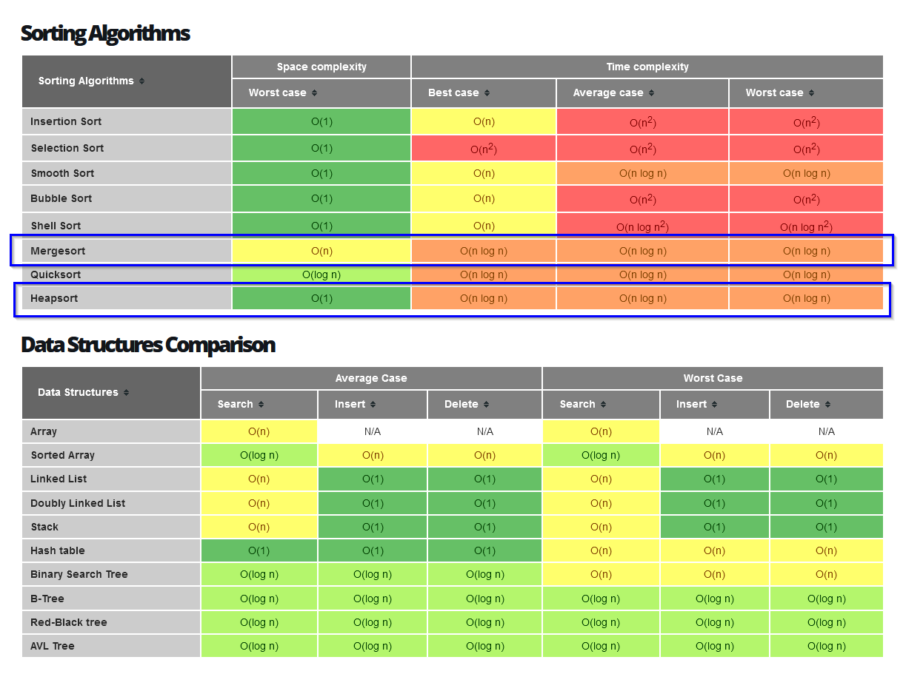

# Data Structures and Algorithms

Use jupyter books:
- can embed Latex
- can embed pictures with MarkDown
- can use anchor links
    - create a title (#, ##, ###, etc) in a #%% md section, such as ### My Great Heading
    - then in another #%% md section, refer above anchor(replace space with -), [My Title](#Data-Structures-and-Algorithms)

Solutions:    
  - intuitive, easy to memorize 
  - try to keep <30 lines, we prefer < 20 lines 
  - with correct runtime and space, as fast as possible while honoring above 2.
  - during interviews, start with simple tests and cover corner cases.  
  - searchable with tags and LeetCode references. However, string search ends with
    html decorated strings. To drill down to the right text, first search for file names,
    then search content inside the file.


Recursion
recursion and tail recursion

import sys
sys.getrecursionlimit()

from functools import lru_cache
@lru_cache(maxsize=None)


scan-track-update


Time and space complexity

optimal solution and other solutions

*Big O notation* is discussed in 
[Introduction to Algorithms](docs/Introduction_to_Algorithms-3E-Comen.pdf)
and [Wiki](https://en.wikipedia.org/wiki/Sorting_algorithm).
This book will be known to us as *ItA*. The major big O dividers are log time,
polynomial time, and exponential time. We use ```logN``` for both base 2 and 
base 10 with clear context, ```lgN``` for base 10, and ```lnN``` for base e.
Sometimes, the constant hiding in the big O is very large.

There is a Python data structure library: http://www.grantjenks.com/docs/sortedcontainers/

Here is an overview
http://cooervo.github.io/Algorithms-DataStructures-BigONotation/index.html


Visualization:
- https://www.cs.usfca.edu/~galles/visualization/about.html  
- https://visualgo.net/en  
- https://algorithm-visualizer.org/ 

https://github.com/JuliaCollections/DataStructures.jl
https://www.cs.auckland.ac.nz/software/AlgAnim/ds_ToC.html

https://web.stanford.edu/class/cs97si/
https://opendsa-server.cs.vt.edu/ODSA/Books/Everything/html/index.html

- [Arrays](docs/data_strcuture/3.array/arrays.md)

https://hackernoon.com/14-patterns-to-ace-any-coding-interview-question-c5bb3357f6ed

← q

http://cooervo.github.io/Algorithms-DataStructures-BigONotation/index.html

Visualization:
- https://www.cs.usfca.edu/~galles/visualization/about.html  
- https://visualgo.net/en  
- https://algorithm-visualizer.org/  


## List Searching and Sorting
___
- Searching (BFS, DFS)
- Sorting

## Regular Expression
___


## Linked Lists
___
- Linked Lists  
https://blog.csdn.net/weixin_37780776/article/details/108066174


- Double Linked Lists
- Cyclic Linked Lists	


## Stacks and Queues
	
## Trees
___
- Binary Trees
- Balanced Trees, Red-Black Trees
- B trees and B+ trees

https://blog.csdn.net/qq_42730750/article/details/108586892

https://www.geeksforgeeks.org/prims-minimum-spanning-tree-mst-greedy-algo-5/
	
## Graphs

Dijkstra’s
https://www.geeksforgeeks.org/python-program-for-dijkstras-shortest-path-algorithm-greedy-algo-7/


back-tracking

DP

Greedy

python collections lib

https://pypi.org/project/binarytree/


## LeetCode

- https://github.com/keon/algorithms
- https://the-algorithms.com/
- https://github.com/TheAlgorithms/website
- 

https://zxi.mytechroad.com/blog/category/leetcode/

https://cstheory.stackexchange.com/


http://www.grantjenks.com/docs/sortedcontainers/sorteddict.html
http://www.grantjenks.com/docs/sortedcontainers/performance.html


https://codereview.stackexchange.com/questions/197040/min-max-heap-implementation-in-python

To write unit tests, first think about coverage, make sure all lines are covered.

https://kennyzhuang.gitbooks.io/algorithms-collection/content/count_of_smaller_numbers_after_self.html

http://staff.ustc.edu.cn/~csli/graduate/algorithms/book6/chap10.htm

http://staff.ustc.edu.cn/~csli/graduate/algorithms/book6/chap08.htm

https://www.tableau.com/learn/articles/books-about-data-structures-algorithms

https://github.com/sunjianbo945/leetcode

https://www.redblobgames.com/pathfinding/a-star/introduction.html

https://www.youtube.com/watch?v=RqQBh_Wbcu4

https://medium.com/swlh/how-to-study-for-data-structures-and-algorithms-interviews-at-faang-65043e00b5df

https://www.cs.princeton.edu/~rs/AlgsDS07/

https://code.activestate.com/recipes/576918/

https://labuladong.gitbook.io/algo-en/iv.-high-frequency-interview-problem/union-find-explanation

http://juliacollections.github.io/DataStructures.jl/v0.17/heaps/
https://github.com/JuliaCollections/DataStructures.jl

## Layout

### Format
```
# LC102. Whatever
# @house robber@, @dfs@, !kmp.pdf!, $120$
def solution() # O(n^2)
   code # comment
```

### Layout
- Problem's data structure goes to folder.
- Algo's data structure or algo goes to file.
